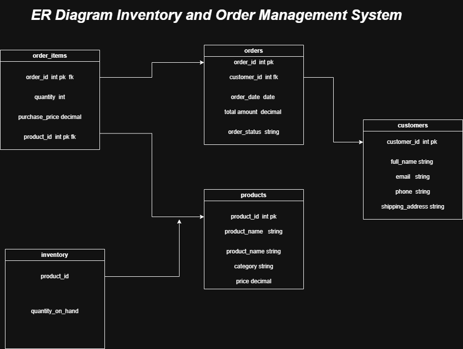

# Inventory & Order Management System

A simple SQL-based project for managing customers, products, inventory, and orders. Includes ERD, DDL schema, sample inserts, and business KPIs.


## ER Diagram


## Folder Structure

```
inventory-and-order-system-management/
│
├── erd/
│     └── er-inventory-and-order-management.drawio.png
│
├── sql/
│     ├── ddl/
│     │     ├── create.tables.sql
│     │     └── insert.tables.sql
│     └── dml/
│           └── kpi.advanced.sql
│
└── README.md
```

---

## What’s Inside

### **1. DDL (create.tables.sql)**

Database schema for:

* Customers
* Products
* Inventory
* Orders
* Order_Items

### **2. Inserts (insert.tables.sql)**

Sample data for testing.

### **3. DML (kpi.advanced.sql)**

Includes:

* Total revenue
* Top customers
* Best-selling products
* Monthly sales trend
* Sales rank by category
* CustomerSalesSummary view
* `ProcessNewOrder` stored procedure

